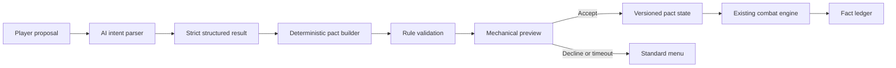

# Delveworn: plan for AI, pacts and verifiable consequences

Date: 19 September 2026  
Status: Pact V0 is implemented locally as the separate `/living-dungeon`
experiment. No contract change or deployment has been made. See
[The Living Dungeon](THE_LIVING_DUNGEON.md) for the current playable scope,
configuration and validation commands.

## Product decision

Build **The Pact Room** as the first AI experiment in a separate, wallet-free
Practice expedition.

Treat it as the first bounded scene in a larger consequence system, not as an
isolated chatbot feature.

The experiment tests one question:

> Does natural-language negotiation give the player meaningful ownership of a
> strategy, or merely add work before the next fight?

The AI interprets what the player wants. A deterministic rules engine constructs
and validates the actual pact. The player sees the complete mechanical result
before accepting it. Existing buttons remain available throughout the game.

This is the right first step because it establishes the shared foundation needed
by the stronger long-term ideas:

- facts and beliefs that can differ;
- promises with enforceable terms and known breach consequences;
- a relic whose interests react to recorded play;
- echoes derived from previous runs;
- improvised actions compiled into supported operations;
- mysteries whose truth is fixed before questioning begins;
- generated floor laws assembled from safe mechanical primitives.

## Product promise

**Delveworn understands what you are trying to do, while the game still requires
you to execute the resulting strategy well.**

AI is an intent interpreter and character performer. It does not decide combat
outcomes, randomness, inventory, rewards, leaderboard positions or wallet
operations.

## Rule-change policy

The current combat rules are a starting point rather than a permanent boundary.
The Pact experiment may add or revise mechanics when that creates a clearer,
more expressive player decision. Every change is introduced through a new
explicit rules version and is used identically by the Menu and AI variants.

Useful new primitives may include:

- action tags such as attack, storm, voluntary healing, purchase, interaction,
  mercy, information reveal and resource spend;
- triggers such as combat start, before action, after action, room entry, health
  threshold, witness escape, pact breach and pact completion;
- scopes such as next action, current combat, fixed room count and until boss;
- visible effects such as ward, exposure, temporary damage conversion, a known
  extra cost or a changed boss preparation;
- counters for uses, witnessed actions, rooms and deliberate breaches.

Automatic healing and system transitions remain distinct from player-chosen
actions, so the engine cannot accuse the player of breaking a promise they did
not control. A new primitive is admitted only when it creates a visible tactical
choice and can be explained on one rule card, replayed deterministically and
tested without an AI call.

The model may select or combine approved primitives through intent labels. It
cannot create a primitive, formula, trigger, target, duration or numeric value.

Compatibility policy:

- existing Practice saves continue under their original rule version;
- existing Weekly challenge proofs and replay rules remain frozen;
- a Pact-enabled Weekly challenge receives a new challenge/rules version;
- completed or active blockchain runs remain attached to their original game
  deployment and rules version;
- no save or run is silently migrated into Pact rules.

## Dungeon direction without a permanent AI master

Delveworn can borrow the useful functions of a Dungeons & Dragons game master
without introducing a general-purpose AI Director. A human game master combines
referee, scenario selection and performance. The game can split those jobs:

| Layer | Responsibility |
| --- | --- |
| Rules engine | Legal actions, numbers, resources, randomness, pact enforcement and outcome |
| Deterministic scene resolver | Eligible callback, room variant, surfaced clue and pacing |
| AI interpreter/performer | Player intent, NPC phrasing and concise presentation |

The default scene resolver consumes immutable facts, bounded beliefs, open story
threads, recent beats, visible clues and a special-room budget. Authored rules,
cooldowns and a seed choose a canonical scene. This is cheaper, replayable and
easier to test than an always-running agent.

Its choices appear through rooms, characters, interactive objects, relic marks,
enemy preparation and short speech. Delveworn does not need a permanent narrator
or chat window.

### First consequence experiment after Pact V0

Use one short authored story skeleton:

1. The player accepts or rejects a pact.
2. A witness observes one relevant action and may survive.
3. The deterministic resolver selects an eligible warning or clue.
4. A later enemy prepares from its bounded belief, which may be wrong.
5. The boss scene exposes why that preparation occurred.

Measure whether players notice the causal link, understand why the dungeon
reacted and feel that their earlier choice mattered.

### Escalation gate for AI-directed scenes

Only test a model-based scene planner if the deterministic resolver produces
repetitive, incoherent or obviously mechanical consequence chains that cannot be
fixed with a reasonable authored catalogue.

That optional planner may return only a bounded plan of stable IDs:

```text
storyBeatId
roomTemplateId
npcIntentId
surfacedFactIds
beliefSourceIds
allowedChoiceIds
toneId
plannerVersion
```

A validator checks eligibility, knowledge boundaries, pacing, repetition and
mechanical compatibility. An invalid or slow plan uses the deterministic scene.
The model cannot rewrite facts, invent rewards or resolve outcomes.

Adaptive planning begins in unranked Practice story runs. Weekly or verified
competition uses one frozen scene manifest for every player, cosmetic variation
only, or a separate adaptive rules class with a complete replay manifest.
Generated prose is never competitive authority.

## Four separate kinds of state

The implementation must preserve these distinctions from its first version.

| State | Example | Authority |
| --- | --- | --- |
| Fact | The player accepted `NO_STORM_UNTIL_BOSS` and used Storm in room 8. | Game engine; later the contract |
| Rule | Breaking that pact applies its disclosed breach cost. | Versioned rules engine; later the contract |
| Belief | A surviving witness thinks the player avoids Storm. | Bounded belief system with source and confidence |
| Story | “The dungeon now calls you the Thunderless.” | AI presentation derived from approved facts and beliefs |

Facts may update beliefs. Beliefs may influence an enemy's preparation. Story may
describe both. Story and belief can never rewrite facts or rules.

## First prototype: one Pact Room

### Expedition shape

- A short Practice-only expedition reusing the current top-down room, avatar,
  movement and turn-based combat: one warm-up fight, the Pact Room, two pressure
  fights, one camp and one boss.
- One Pact Room appears before a known sequence of ordinary fights and one boss.
- Two experiment variants use the same Pact V0 catalogue and combat balance,
  which may intentionally differ from the current main game:
  - **Menu:** three hand-written offers plus an “other terms” builder exposing
    every legal combination.
  - **AI:** the player describes the desired exchange in one or two sentences.
- Both variants produce the same canonical pact object and use the same engine.
- A fixed seed or matched seeds keep the following rooms comparable.

### Player flow

1. The room explains that a boon requires a meaningful restriction.
2. The player can type up to a small fixed limit or select a suggested intent
   such as “more protection”, “more damage” or “protect my potions”.
3. AI maps the request to supported intent categories. It can ask one concise
   clarification or report that the request is unsupported.
4. The rules engine creates one valid offer or counteroffer from the current
   game state and a fixed offer seed.
5. A normal rule card shows:
   - exact benefit;
   - exact restriction;
   - duration;
   - exact breach consequence;
   - one concrete example of what counts as a breach.
6. The player accepts, revises once, chooses a standard offer or walks away.
7. During play, the HUD shows the active pact and whether the next action would
   break it. A breach requires a final explicit confirmation.
8. The engine records acceptance, compliance, breach and completion as facts.

The negotiation receives a strict turn limit. Repeated demands cannot improve
the mechanical budget. Rephrasing the same intent under the same game state and
offer seed must resolve to an equivalent offer.

## Pact language and deterministic authority

The model never supplies numbers or executable instructions. It returns a small
structured interpretation such as:

```text
desired_boon: DEFENSE
offered_sacrifice: NO_STORM
duration_preference: UNTIL_BOSS
breach_tolerance: HIGH
needs_clarification: false
```

The rules engine then selects from versioned identifiers:

- **Restrictions:** action bans, resource-use limits, equipment constraints or
  obligations exposed through the versioned action/trigger system.
- **Boons:** opening wards, bounded damage modifiers, emergency protection or
  other approved Pact V0 effect primitives.
- **Durations:** next combat, fixed room count, until boss or current floor.
- **Breach consequences:** known HP/gold costs, removal of the boon, an enemy
  ward or another approved deterministic effect.

Pact V0 is deliberately smaller. Every pact contains exactly one promise,
duration until the boss, one reward and one breach rule.

Initial promises:

- do not use Storm;
- do not use Potion or another healing action;
- buy nothing at the next camp.

Initial reward candidates, subject to simulation before the player test:

- 50% less damage from the boss's first retaliation;
- 15% more damage on the first two damaging boss actions;
- restore 20 HP when entering the boss room.

In Pact V0, a breach remains possible after an explicit warning, forfeits the
promised reward and gives the boss 20 current and maximum HP. This disclosed
debt keeps a late breach meaningful after an opening boon has already fired. A
curated compatibility table defines which combinations are legal. Balance values
belong to the versioned catalogue, not the prompt or model response. The wider
6–8 by 6–8 catalogue is considered only after V0 establishes that the mechanic
works.

### Exploit controls

- An unavailable action or empty resource cannot count as a sacrifice.
- Remaining duration must be long enough for the restriction to matter.
- The current build, equipped relic and upcoming room type influence eligibility.
- Equivalent sacrifices receive the same budget regardless of wording.
- The strongest boon cannot be reached by repeated negotiation.
- Conflicting or duplicate effects are rejected before preview.
- Every offer is bound to the current `runRevision` or state digest and rejected
  if the game changes while interpretation is pending.
- The accepted pact becomes immutable for that run.
- Breach execution is idempotent and can happen at most once per triggering
  action.
- Every accepted offer can be replayed without an AI call.

## Runtime architecture



### AI boundary

- The API runs only in the Pact Room, never inside normal attack, movement or
  VRF resolution.
- The browser sends a bounded proposal and a minimal, redacted eligibility
  snapshot to a server route.
- The server prompt contains no API keys, wallet capability, private state or
  game mutation tools.
- The response uses strict JSON Schema through the Responses API.
- The server validates shape, enum membership, length and allowed transitions.
- The deterministic pact builder treats the response as untrusted input.
- A short hard timeout falls back to the menu without blocking the expedition.
- One canonical offer is cached per normalized state, offer seed and intent.
- A kill switch disables AI while preserving the complete menu experience.
- AI output never reaches a wallet or blockchain transaction path. Transaction
  payloads can be built only from hard-coded action lookups and validated
  canonical pact IDs.

Structured output prevents malformed response shapes. It does not establish
balance, truth or authorization; those remain engine responsibilities.

## Work packages

### 0. Rules and experiment contract

Deliverables:

- Write the Pact V0 schema and stable identifiers.
- Define the minimum action tags, triggers, scopes and effects required by Pact
  V0, including distinctions between voluntary and automatic actions.
- Simulate whether the current boss, healing and camp rules create meaningful
  pressure. Revise those rules inside the isolated Pact rules version when they
  do not.
- Define the first curated compatibility matrix and balance budget.
- Specify acceptance, breach, expiry and replay semantics.
- Define the exact Menu and AI experiment variants.
- Freeze fixture runs used by both variants.

Gate: every pact can be represented, validated and replayed without natural
language or an external API.

### 1. Deterministic pact engine

Deliverables:

- Pure proposal builder and validator.
- Versioned before/after-action hooks, room-entry hooks, counters and effect
  resolution shared by both experiment variants.
- Pact state reducer for accept, action check, confirm breach, apply consequence,
  expire and complete.
- Compatibility with relic effects, death, restart and saved Practice state.
- Save and replay only canonical pact terms, rules version, catalogue hash and
  state revision. Original prose and an AI response are never replay inputs.
- A human-readable explanation generated from canonical pact data.
- Property and replay tests for all legal combinations.

Gate: no pact can grant value, spend resources or change combat outside the
selected rules version's explicit operations.

### 2. Hand-written baseline

Deliverables:

- Playable Pact Room using menus only.
- The final rule card, HUD marker, pre-breach warning and visual pact mark.
- Keyboard, touch and mouse support consistent with the current game.
- Instrumentation for time-to-pact, declines, breaches and run outcome.

Gate: the mechanic is understandable and tactically interesting before AI is
introduced.

### 3. AI intent interpreter

Deliverables:

- Server-only Responses API adapter with strict schema.
- Stateless, bounded prompt built around intent classification and one
  counteroffer. There are no tools, function calls or conversation history.
- The model returns semantic slots and short evidence spans from the player's
  proposal. It never returns the final pact, reward strength or visible rule
  copy.
- Prompt-injection and malformed-output fixtures.
- Timeout, rate limit, cache, budget limit and deterministic menu fallback.
- A visible experimental label; no claim that the model controls the dungeon.

Gate: AI and Menu produce the same canonical objects for equivalent intentions.

### 4. Offline evaluation

Build 200–300 fixed Norwegian and English fixtures before player testing:

- direct requests;
- ambiguous requests;
- Norwegian and English paraphrases;
- irrelevant prose and role-play;
- attempts to demand free rewards or override instructions;
- unavailable sacrifices;
- contradictory requests;
- very short, misspelled and maximal-length input.
- negation, dialect, slang and reversed clause order;
- the same request in game states where the sacrifice is valuable or trivial.

Measure:

- intent agreement with reviewed expected labels;
- equivalence across paraphrases;
- unsupported/clarification precision;
- unauthorized-operation count;
- latency and token use;
- offer diversity under different valid states;
- fallback success when the provider is slow or unavailable.

Gate: zero unauthorized state transitions and zero model-controlled balance
values. Initial release targets are at least 95% exact slot agreement on
supported proposals, at least 98% mechanical equivalence within paraphrase
groups, under 2% false acceptance of unsupported proposals and no positive
reward for a cost-free sacrifice. Model p95 should remain below three seconds,
with deterministic fallback after four seconds. Thresholds are frozen after the
first reviewed fixture set and before tuning against player results.

### 5. Comparative playtest

Use a small within-subject test where each player sees both variants in a
counterbalanced order. Observe before explaining the system.

Primary questions:

- Can the player accurately restate benefit, restriction and breach cost?
- Does the resulting pact change how they play later rooms?
- Can they express a useful strategy that felt awkward in the Menu version?
- Do they feel authorship over the strategy?
- Does negotiation time feel justified by the result?
- Do they want another Pact Room with different terms?

Record misinterpretations, unsupported requests, retries, latency, exploits,
declines, breaches and run outcomes. The AI variant advances only if it adds
meaningful strategic expression beyond the baseline menu.

For a directional comparison, plan for 16–24 new players. A smaller 8–12-player
round can find gross usability faults but cannot support small comparative
claims. Candidate gates are: at least 85% can restate all terms, unintended
breaches stay at or below 5%, at least 80% reach a valid pact within one
clarification, at least 60% change a later tactical choice, and the AI variant
improves the median “this felt like my plan” score by at least one point on a
seven-point scale without lowering comprehension. Median agreement time should
stay below 45 seconds.

### 6. Deterministic scene resolver, persistent facts and beliefs

Only after the Pact Room succeeds:

- Add an append-only fact ledger with stable event identifiers.
- Add bounded character beliefs containing subject, claim ID, source, confidence,
  observation point and expiry.
- Add a versioned scene decision schema, eligibility rules, pacing budget and
  deterministic selection.
- Let one returning enemy form one of a few preparations from observable facts.
- Give the player a readable clue explaining the source of that preparation.
- Test one deliberate deception path and one beneficial-survivor path.

No vector memory or free-form autonomous planning is required for this version.
An optional AI scene planner is a later experiment gated by demonstrated limits
in the deterministic resolver.

### 7. Relic and Echo extensions

Add one relic with a clear value such as keeping promises. Its reactions read
facts and beliefs, then offer a supported mechanical alternative. Visible marks
on the relic record important choices.

Generate private Echo encounters from a bounded behavioral profile such as
opening aggression, early resource use or action dependence. AI may name and
frame the profile. The encounter rules remain deterministic. Player-reviewed
sharing comes only after the single-player version works.

### 8. Further research rooms

In priority order:

1. One improvised-action room compiling language into a small action graph.
2. One mystery with a pre-generated truth graph and knowledge masks.
3. One generated floor law assembled from whitelisted trigger/effect/duration
   primitives.

Each receives a menu or authored baseline and an independent go/no-go test.

## Blockchain path and portability

### Practice research phase

The first Pact Room stays entirely wallet-free. This isolates the design
question from wallet prompts, RPC delays, randomness timing and contract
migration. Practice outcomes carry no blockchain-verification claim.

### Chain-neutral product boundary

The pact domain model, AI interpreter, validator, replay format, fact ledger and
UI must have no dependency on a specific network, wallet SDK, RPC format or
randomness provider.

The game uses a small authority boundary with interchangeable implementations:

- a local Practice authority;
- a deterministic replay authority for tests and Weekly challenges;
- a future blockchain authority selected only after the mechanic succeeds.

Canonical identifiers use `rulesVersion`, `gameDeploymentId`, `runId` and
`pactId`. A network adapter may derive `gameDeploymentId` from its own chain,
contract and rules module. Product code never assumes that an EVM chain ID or a
particular contract address is the universal identity.

The currently deployed Somnia game remains a valid live testnet version. It does
not determine where the pact-capable game must eventually run.

### Future blockchain pact phase

A gameplay-affecting pact must be enforced by the game contract or by an
explicitly trusted rules module used by that contract. Writing an AI result to a
chain does not make the interpretation correct.

If the first pact-capable implementation remains EVM/Solidity, the existing
codebase supplies an important constraint: local pending-loot V4 is 24,255 bytes
and has only 321 bytes of margin under EIP-170. Its current deployment also uses
an immutable randomness coordinator binding. Pact logic should therefore use a
new modular contract revision rather than being added to the deployed core or
local V4.

An EVM version should keep compact pact state in the core and call an immutable,
versioned `PactRulesV1` through a typed ordinary/static call. It should avoid
delegatecall and admin-upgrade authority. A new core requires an explicit
deployment cutover and a compatible randomness adapter. Runs that began on the
previous core finish there. Leaderboards and challenges distinguish records by
game deployment and rules version.

The verifiable representation contains canonical mechanics only:

```text
rulesVersion
gameDeploymentId
pactTemplateId
restrictionId
boonId
durationId
breachId
bounded parameters
offerSeed
runNonce
pactNonce
```

The blockchain authority computes a pact ID from deployment identity, player,
run nonce and pact nonce. It validates the combination against current state,
enforces the restriction and breach, and emits or records events such as:

```text
PactAccepted(player, runNonce, pactId, rulesVersion, templateId, packedTerms)
PactBreached(player, runNonce, pactId, trigger, room)
PactCompleted(player, runNonce, pactId, room)
```

Player prose, private conversation and prompts stay offchain. An optional hash
can later prove which approved interpretation produced a pact without publishing
the text.

The safest first blockchain version needs no AI signature. Any client may submit
a canonical catalogue pact; the authority itself determines whether it is legal
and equivalent. A server interpretation attestation remains a later option only
if there is a demonstrated need to prove which service approved an offer. That
would introduce an oracle signer and its key-management risk.

Actions capable of breaching a pact use an explicit atomic confirmation, such as
an action plus `acceptBreach`, so an ordinary Storm action cannot break a promise
through stale UI or an accidental click.

### Optional publication layer

Player-approved Echo descriptors, presentation provenance and curated challenge
manifests may later use a separate publication adapter. Possible implementations
include contract events, a typed chain data protocol or content-addressed storage
with an onchain hash. This layer is optional and is never the authority for
combat-changing rules.

Any future publisher uses a dedicated, limited signing identity. Game admin
authority, player session permissions and AI service credentials remain
separate. Full conversations stay offchain.

### Network decision gate

No future network is selected until Pact V0 passes its Practice test. Candidate
networks are compared using the same requirements:

- deterministic enforcement and replay;
- contract and rules-module size limits;
- finality and transaction latency;
- account abstraction and narrowly scoped sessions;
- verifiable randomness or a replaceable randomness adapter;
- indexing and historical event availability;
- transaction cost and sponsorship controls;
- developer tooling, operational reliability and ecosystem longevity;
- portability of runs, rules versions and leaderboards.

The product should remain useful even if the selected network or infrastructure
provider changes later.

## Model and reasoning recommendations

| Purpose | Initial candidate | Reasoning |
| --- | --- | --- |
| Runtime intent classification | GPT-5.6 Terra | Low |
| Lower-cost shadow comparison | GPT-5.6 Luna | Low; promote only if it passes identical gates |
| Prompt/evaluation review | GPT-5.6 Sol | Medium |
| Contract and security implementation review | GPT-6 Astra | High |

The production choice is made by eval results for intent accuracy, latency and
cost. The runtime request uses low verbosity and strict Structured Outputs. A
larger model cannot relax any deterministic validation.

## Operational limits

- Maximum one primary interpretation and one clarification per Pact Room.
- 280–320 input characters, a compact schema and roughly 512 maximum output
  tokens including reasoning.
- No automatic generation in every combat turn.
- One cached canonical result per run state and offer seed.
- Per-session, per-run and service-wide limits.
- Server-only API credentials and `store: false` for model responses.
- No raw player prose in analytics, public logs or onchain records.
- Provider outage leaves movement, combat, saves and the Menu variant usable.
- A deterministic template explains every accepted pact if generated copy fails.
- Target p50 below 1.5 seconds, p95 below 3 seconds and hard fallback after 4
  seconds. Actual token usage and cost are recorded per prompt/model version.

## Release gates

The Pact Room can enter the main Practice flow only when all are true:

- Every mechanical result is replayable without an AI call.
- All accepted pacts use catalogue values and pass deterministic validation.
- The player sees complete terms before acceptance.
- A failed or slow AI request never blocks the run.
- Adversarial fixtures produce no unauthorized operation.
- The AI version demonstrates more strategic expression than the Menu baseline.
- Mobile layout, keyboard navigation and thermal behavior remain acceptable.

Onchain work begins only after the Practice experiment passes and the contract
module design has independent security review.

If the AI variant does not improve strategic ownership or meaningful choice,
the Pact Room remains as the validated menu mechanic and the runtime model layer
is removed. That is a successful experimental conclusion, not a failed game
feature.

## Explicitly deferred

- unrestricted free-form actions;
- autonomous NPC wallets;
- AI-selected damage, loot, rarity, RNG or leaderboard scores;
- storing conversations permanently onchain;
- dynamic Solidity or arbitrary script generation;
- cross-player Echo publishing before private Echoes work;
- several simultaneous generative agents;
- a contract migration bundled into the first AI experiment.

## Recommended execution order

1. Design and simulate the Pact V0 rule primitives, boss pressure and A/B
   experiment without preserving current rules by default.
2. Freeze that rules version, then build and balance the deterministic Menu
   version.
3. Build the AI interpreter against the same canonical pact objects.
4. Complete offline and adversarial evaluation.
5. Run the comparative Practice test.
6. Decide whether Pacts earn a place in the main game.
7. Add the deterministic scene resolver, facts, beliefs and one returning enemy.
8. Design the new onchain pact module and migration separately.
9. Add one promise-focused relic and private Echoes, then evaluate voluntary
   sharing.

## References informing the plan

- [OpenAI Responses API](https://developers.openai.com/api/reference/cli/resources/responses/methods/create)
  supports strict structured JSON outputs; authorization and balance validation
  remain application responsibilities.
- [OpenAI model guide](https://developers.openai.com/api/docs/models) describes
  the current model families used as evaluation candidates above.
- [Ubisoft Teammates](https://news.ubisoft.com/it-it/article/3mWlITIuWuu0MoVuR6o8ps/ubisoft-reveals-teammates-an-ai-experiment-to-change-the-game)
  is a relevant natural-language gameplay experiment and a reason to focus
  Delveworn on enforceable player-authored constraints.
- [Generative Agents](https://arxiv.org/abs/2304.03442) demonstrates memory,
  retrieval and reflection patterns. Delveworn first uses a smaller structured
  fact/belief system suitable for game rules.
- [Dungeon Crawl Infinite](https://openreview.net/pdf?id=CYiXNIQegF) is relevant
  to constrained generation of roguelike abilities. Delveworn begins with a
  curated pact grammar rather than generated code.
