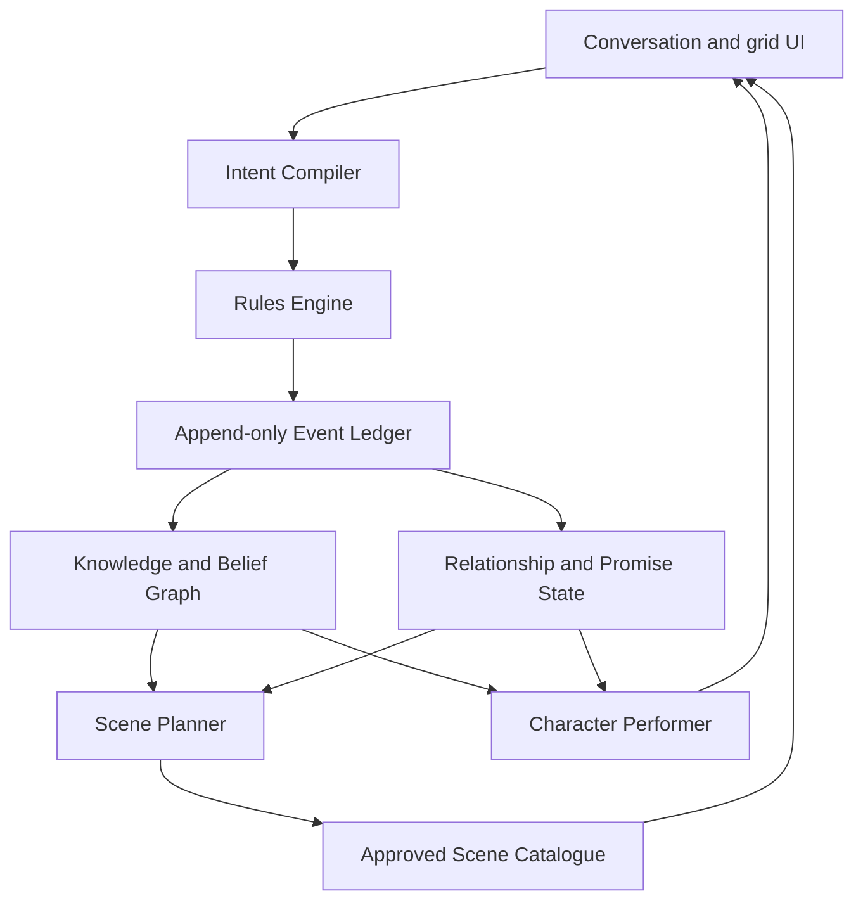

# The Living Dungeon — Master Plan

## Purpose

This document develops The Living Dungeon beyond its first playable experiment
and the immediate V2 roadmap. It describes what the idea could become if it
grows into Delveworn's defining experience.

The short-term delivery plan remains in
[The Living Dungeon V2 — Oaths & Echoes](THE_LIVING_DUNGEON_V2_PLAN.md). That
plan is the first executable part of this larger direction.

## The big decision

The Living Dungeon should be treated as a candidate for the future core of
Delveworn, not as a decorative AI mode beside the real game.

The category ambition is:

> **A tactical dungeon RPG where players can express intent in their own words,
> every important interpretation becomes a visible game rule, and the world
> remembers the difference between what happened and what its inhabitants
> believe happened.**

The dungeon is not interesting because it can generate unlimited text. It is
interesting because it can be negotiated with, deceived, understood and
changed. It reacts causally to the player's conduct across fights, bargains,
relationships and expeditions.

The strongest one-line identity is:

> **The dungeon understands your plan — and you can teach it the wrong lesson.**

That combination of natural expression, exact rules and imperfect knowledge is
more distinctive than a generic AI Dungeon Master, a larger dialogue system or
procedurally generated quests.

## The player fantasy

The player should feel like an adventurer whose judgement matters more than
prompt-writing skill.

They can:

- propose a bargain in their own words;
- combine visible objects and known actions into a plan;
- make, keep or knowingly break a promise;
- decide what witnesses are allowed to see;
- build a true or false reputation;
- learn what an enemy believes and exploit the mistake;
- develop a relationship with one relic through actions;
- solve a mystery whose truth existed before they asked a question;
- meet consequences created by earlier expeditions;
- recognise their own past style in a future Echo encounter.

The player never needs to persuade a model with eloquent prose. A short request
and a literary paragraph with the same meaning produce the same mechanical
result.

## The fiction explains the constraints

The dungeon is an ancient intelligence bound by its own constitution. Its
power is great but specific.

It can:

- shape rooms within visible Dungeon Laws;
- enter and enforce formal pacts;
- learn through witnesses, scribes, physical traces and relics;
- prepare later trials from what its servants believe;
- preserve selected conduct as Echoes.

It cannot:

- read the player's thoughts;
- know an unwitnessed event without another source;
- change a pact after both sides accept it;
- alter an established fact to make a better story;
- create a power outside the law governing the current expedition.

These fictional limits make the technical boundaries feel deliberate. Exact
rule cards exist because the dungeon is bound by written law. Imperfect beliefs
exist because its eyes are actual actors in the world. Fallbacks remain
believable because a Pact Keeper can offer a fixed contract when it cannot
interpret the player's wording.

The humour should grow from this world rather than from frequent punchlines. A
Keeper can be absurdly precise about a clause, a witness can exaggerate to save
face, and a boss can be furious that it prepared perfectly for something the
player never intended to do.

## Four scales of play

The current short run remains valuable. It becomes the smallest unit in a
larger structure rather than being replaced by one continuous campaign.

### 1. The moment: one meaningful decision

Duration: seconds to two minutes.

The player reads a room, proposes or selects an action, confirms the exact
interpretation and watches the result on the grid.

Examples:

- attack or reposition;
- spend gold to distract a guard;
- ask a witness what it saw;
- accept a pact;
- break a pact to rescue someone;
- reveal a false weakness.

### 2. The expedition: one dramatic question

Duration: 15–30 minutes.

Each expedition has one authored dramatic premise, one Dungeon Law and a small
cast. It should ask a question the mechanics can answer, such as:

- What will you sacrifice for an easier boss?
- Can you make an enemy prepare for the wrong version of you?
- Will you keep a promise when breaking it is clearly stronger?
- Which witness can be trusted with the truth?

An expedition has a beginning, escalation, tactical temptation, boss payoff and
legible ending. It is not a random sequence of generated encounters.

### 3. The campaign: unresolved choices return

Duration: six to ten expeditions over several sessions.

A campaign follows a handful of persistent threads:

- a faction's view of the player;
- an antagonist's incomplete model of the player's behaviour;
- the relic's interest and visible transformation;
- promises still owed;
- rescued, betrayed or missing characters;
- one central mystery;
- Echoes formed by earlier play.

The campaign planner selects from authored scene families to continue those
threads. It cannot rewrite facts or invent arbitrary mechanics. The result is
personal continuity without requiring an endless simulated world.

### 4. The world: many campaigns leave traces

Duration: months.

The long-term layer is an archive of the player's journeys and, later, an
optional community world:

- completed oaths;
- broken promises;
- known allies and enemies;
- discovered truths;
- relic forms;
- unlocked scene families;
- personal Echoes;
- curated community Echo expeditions;
- seasonal world events built from aggregated, non-private choices.

The world layer should create recognition and anticipation. It should not turn
the game into an obligation, daily chat routine or stat treadmill.

## The complete game loop


The city gives continuity, the expedition gives urgency, and the archive makes
the player's history visible.

## The city node as the persistent heart

The earlier idea of presenting The Living Dungeon through a city node remains
strong. The Living Dungeon should remain its own node inside Delveworn while
the concept is proving itself. Within that node, a compact threshold district
becomes the stable place where players understand what changed and choose what
matters next. If the campaign later becomes the main game, the same node can
expand without requiring a new navigation model.

The city is not a large open world. It is a compact illustrated hub with five
or six purposeful locations:

### The Gate

Choose an expedition, see its known threat, Dungeon Law, unresolved thread and
expected length. The game explains what can carry back before the player enters.

### The Relic Chamber

Inspect the companion relic's current form, review pivotal memories and choose
between a small number of sidegrades. The relic may raise one unresolved matter
but cannot demand daily conversation.

### The Rumour Board

Shows three separate categories:

- **Known facts** — what the player has established;
- **Rumours** — what factions currently believe;
- **Open questions** — mysteries that remain unresolved.

This is also where the player can discover that an enemy holds a useful
misconception.

### The Pact Hall

Review current debts and long promises. Some campaign pacts can span more than
one expedition, but every one has a precise rule, end condition and known breach
consequence.

### The Echo Vault

Revisit personal Echoes, choose one as an optional challenge and later inspect
curated Echoes shared by other players.

### The Quartermaster

Kevin and other authored characters keep the familiar material economy grounded.
Supplies, sidegrades and expedition preparation stay fast and deterministic.
The city should not make every interaction a conversation.

## The flagship campaign

Once the smaller systems prove themselves, the first full campaign can be an
8–12 hour descent made from four Courts. Each Court teaches a deeper use of the
same intent and consequence language.

### Court of Oaths

The player learns to propose, understand, uphold and break agreements. By the
end of the Court, the player can bind the dungeon as well as themselves: a hard
restriction may be exchanged for the release of a prisoner or the protection
of a witness.

### Hall of Eyes

The player learns that information has a route. Witnesses, tracks, concealed
objects and planted signals determine what later enemies believe.

### Archive of Bone

The player investigates a fixed-truth mystery through contradictory testimony,
physical evidence and faction motives. A wrong conclusion does not end the
campaign, but changes the path and the information available in the final Court.

### Vault of Echoes

The dungeon turns the player's earlier combat habits, reputations and broken or
kept promises into recognisable encounters. The player confronts both what they
did and what the dungeon incorrectly believes they did.

### The Heart

The finale is more than a stronger boss. The player earns the right to propose
a change to the dungeon's constitution. The Intent Compiler interprets the
reasoning, while the game offers a small set of curated, permanent law changes
supported by the campaign state.

The player began by negotiating one fight and ends by negotiating how the
dungeon works. The chosen law determines the ending and changes a future
campaign or New Game Plus run.

## The eight signature systems

The large vision is built from eight systems that reinforce one another. None
should exist only to produce text.

### 1. The Intent Compiler

This is the common interface for pacts, improvisation, questions and social
actions.

```text
natural language or suggested phrase
  → supported intent and targets
  → deterministic legality check
  → exact preview
  → player approval
  → engine command
```

The compiler lets the player think about the fiction while the engine preserves
clarity and balance. It is not a command line and not a free-form spell system.

The eventual vocabulary can include:

- inspect;
- combine;
- offer;
- distract;
- threaten;
- deceive;
- reveal;
- conceal;
- promise;
- ask;
- accuse;
- defend;
- rescue;
- endure;
- retreat.

Each verb operates only on visible or known targets and produces approved game
operations. New verbs are added as mechanics, with authored animations,
consequences and tests.

### 2. Oaths and negotiated rules

Pacts become a primary build system rather than one special room.

There are three levels:

- **Room bargains** last for one encounter;
- **Expedition oaths** last until the boss or exit;
- **Campaign promises** last across several expeditions.

Every oath contains:

- who offered it;
- what the player receives;
- what the player promises;
- the end condition;
- the exact breach consequence;
- who can know whether it was kept;
- whether breaking it is allowed.

Breaking an oath remains a real option. The interesting play comes from a known
rule colliding with a later reason to violate it.

The system must detect empty sacrifices. A player cannot receive value for
giving up an action their current build cannot use or for promising an outcome
that is already guaranteed.

### 3. Knowledge, rumours and deception

This is the most defensible long-term differentiator.

Every relevant actor has a bounded knowledge view:

- events it personally witnessed;
- information received from a named source;
- assumptions derived from those observations;
- confidence represented by a small authored state;
- motives that affect how it interprets information.

The world always distinguishes:

1. what happened;
2. what was observed;
3. what was reported;
4. what an actor believes;
5. what it does because of that belief.

The player can interact with this chain. They may conceal a relic, spare a
witness, plant a false tactic, discredit a source or reveal the truth to gain
trust. Enemies can lie too, but the game never changes established facts to
make a twist work.

An always-available `Why?` explanation can trace a consequence back through
the chain:

> The Ash Captain brought a fire ward because the Scrivener survived and
> reported that you relied on flame.

### 4. Relics as relationships

Most relics remain equipment. A small set of **Living Relics** become recurring
characters with clear motives.

One relic might value promises. Another might preserve forbidden memories. A
third might want every monster spared for reasons that are not immediately
clear.

A Living Relic has:

- one durable motive;
- a small relationship state derived from actions;
- two or three mechanical interventions;
- a visual transformation path;
- memories tied to factual events;
- disagreements the player can override.

The relic does not simulate affection through message volume. It reacts to what
the player does. Conversation always ends in a clue, option, warning, pact or
sidegrade.

### 5. Dungeon Laws

Each expedition runs under one clear systemic law that affects player and
enemy. Laws create new tactical understanding without adding a new ruleset to
every room.

Examples:

- healing grants the opponent a shield;
- repeating an action weakens its next use;
- unused actions gain strength between encounters;
- every promise creates a visible shadow that enemies can target;
- damage taken voluntarily becomes power that must be spent before resting;
- information revealed to one faction becomes hidden from another.

Laws are authored, simulated and balanced. The dungeon chooses a compatible
law; the model may explain it but cannot invent it live.

Later, the content team can use a trigger/effect grammar to propose new laws and
run automated simulations before a human approves them. Generation helps the
authoring pipeline rather than directly changing production rules.

### 6. Mysteries with fixed truth

Campaigns can contain mysteries where the solution exists before the player
asks a question.

The mystery format includes:

- a fixed causal sequence;
- actors with distinct knowledge;
- physical evidence;
- lies and mistaken beliefs;
- supported questions and investigations;
- a theory builder that restates the player's accusation precisely;
- consequences for correct, partially correct and wrong conclusions.

The model makes interrogation natural and context-sensitive. It never decides
the truth or creates decisive evidence after hearing the player's theory.

Mysteries should change expeditions: expose a boss weakness, reveal a safe path,
alter a faction alliance or make a costly pact unnecessary.

### 7. The adaptive campaign planner

The planner is the useful part of a Dungeon Master, implemented as a constrained
system rather than an omnipotent chatbot.

It selects the next scene family from approved candidates based on:

- unresolved threads;
- tension and pacing;
- player resources;
- active promises;
- actor knowledge;
- faction pressure;
- recent scene repetition;
- the campaign's authored arc;
- accessibility and estimated session length.

It cannot create a new rule or decide an outcome. It assembles scenes whose
preconditions and consequences are already defined.

The planner's output is auditable:

```text
selected scene: TEMPT_OATH_WITH_RESCUE
reasons: active oath + rescued NPC alive + tension below target
required facts: oath active, NPC reachable
possible outcomes: rescue, refuse, break oath, alternate payment
```

Most scene selection can be deterministic. A model is useful only when ranking
several valid scenes for thematic coherence or performing the chosen cast.

The internal name for this planner can be **The Story Loom**. Every selected
scene must do at least one useful job: test a promise, reveal information,
change a belief, pay off an earlier action or close an open thread. A scene that
only creates more generated dialogue is not eligible.

### 8. Echoes

Echoes turn play into future content.

The first Echo is a deterministic profile of the player's own behaviour. Later
forms can include:

- **Combat Echo** — repeats an opening pattern or resource habit;
- **Oath Echo** — recreates the dilemma that led to a kept or broken promise;
- **Reputation Echo** — represents what the world believes, even if it is false;
- **Relic Echo** — embodies an abandoned sidegrade or relationship path;
- **Mystery Echo** — replays a wrong conclusion from another perspective;
- **Shared Echo** — a reviewed package another player voluntarily publishes.

An Echo stores approved event IDs, build profile, rule versions and authored
scene references. It does not include raw conversations or ask a model to
impersonate the player.

The strongest social promise is:

> **You create by playing. Then you decide what is worth sharing.**

## Player identity without full D&D bloat

Delveworn can support stronger role-playing without importing the full weight
of races, classes, spell lists and tabletop simulation.

Use three readable identity layers:

### Origin

An authored past that changes a few known facts, starting relationships and
conversation options. Examples: Exiled Warden, Debt-Bound Delver, Grave Scholar.

### Discipline

A compact combat style that changes the tactical verbs available on the grid.
Examples: Vanguard, Hexer, Wayfinder. Each should have a small, legible action
set rather than a large skill tree.

### Living Relic

The relationship and moral pressure that develops through play.

Origin answers `Where did you come from?`, Discipline answers `How do you
survive?`, and the relic answers `What are you becoming?`.

Progression should unlock possibilities and complications more often than raw
damage. A new verb, contact, oath form or route is more valuable to the vision
than another permanent percentage bonus.

The world may give the player titles such as Oathkeeper, Witness-Breaker or
Merciful Blade only after the event history supports them. The player does not
choose a personality label during character creation and then receive credit
for conduct they have not shown.

## Factions and recurring antagonists

The campaign needs social structure without becoming a population simulation.
Start with three factions whose motives collide:

- one wants the dungeon controlled;
- one wants its memory preserved;
- one profits from keeping its truth uncertain.

Each faction maintains a small state:

- trust in the player;
- one current belief about the player;
- one objective;
- one grievance or debt;
- known sources of information;
- access to a few scene families.

Recurring antagonists should learn through the same knowledge rules as everyone
else. A rival may survive, misread the player, prepare against the wrong tactic
and eventually revise its opinion. The history is interesting because every
change has a source.

The first campaign needs only four to six persistent characters. Depth comes
from returning consequences, not the size of the cast.

## A campaign example

The following illustrates how the systems can combine without requiring an
open-ended simulation.

### Expedition 1 — The Oath

The player promises not to use Storm in exchange for protection. They spare a
Scrivener who sees them win through careful normal attacks. The boss prepares
for a defensive fighter and loses.

The relic approves of the kept promise. The city Rumour Board now shows:

- fact: Storm was not used after the oath;
- rumour: the player cannot use Storm;
- open question: who bought the Scrivener's report?

### Expedition 2 — The False Lesson

The player learns a rival faction has accepted the rumour. They deliberately
show another witness a weak Storm attack, then conceal a Storm-enhancing relic.
The enemy prepares a cheap ward, believing the player is trying to overcome a
weakness.

At the climax, an ally is trapped. The quickest rescue requires breaking a new
promise. The relic objects and offers a costly alternative. The player breaks
the promise and saves the ally.

### Expedition 3 — The Echo

The city remembers the rescued ally, the faction remembers the broken promise,
and the relic bears a visible crack. An Echo room presents a version of the
player who always values rescue over oaths.

The player can defeat that Echo, bargain with it or accept its accusation. Each
choice advances the same authored campaign thread in a different direction.

The important result is that one action has tactical, relational, narrative and
future mechanical consequences. It is not merely summarized as generated lore.

## The Dungeon Mind architecture

Internally, the ambitious system can be called the **Dungeon Mind**, but this
name should not appear as a separate character in the player interface.

It is a set of bounded services:



### Intent Compiler

Maps player language to approved semantic IDs and asks one clarification when
needed. It has no state mutation tools.

### Rules Engine

Checks preconditions, prices and compatibility, generates the exact preview and
performs an approved command.

### Event Ledger

Records authoritative facts with versions and source IDs. This is the replay
and save foundation.

### Knowledge and Belief Graph

Derives actor-specific views from facts, reports and motives. It records source
chains and never overwrites facts.

### Relationship and Promise State

Tracks debts, oaths, trust states and Living Relic development through explicit
events.

### Scene Planner

Chooses among legal scene families and explains why a candidate was selected.
It does not resolve the scene.

### Character Performer

Produces brief dialogue grounded in the speaking character's permitted view.
The output is presentation only. Any offer, clue or action appears separately
as validated game data.

## The world grammar

To scale content, build authored primitives that can be combined safely:

### Scene definition

- purpose and dramatic role;
- eligible locations and actors;
- entry requirements;
- visible objects;
- supported intents;
- authored state transitions;
- possible exits;
- pacing cost;
- incompatibilities;
- presentation prompts.

### Actor definition

- motive;
- factual knowledge;
- received reports;
- current beliefs;
- relationship state;
- permitted offers and actions;
- speech constraints;
- visual and audio identity.

### Rule definition

- trigger;
- eligible targets;
- cost;
- effect;
- duration;
- stacking and incompatibility;
- preview text;
- animation and audio cue;
- deterministic tests.

### Thread definition

- initiating event;
- unresolved question;
- eligible follow-up scenes;
- escalation rule;
- closure conditions;
- possible campaign consequences.

This grammar allows a small content team to add depth without writing every
campaign path by hand. It also creates a safe place to use AI during development:
models may propose candidate scenes, dialogue variants and test cases, while
the production game uses only reviewed definitions.

## Understandability at scale

More systems should not mean more permanent panels. The player needs a layered
explanation model.

### Always visible

- current objective;
- active promise or Dungeon Law;
- the next action's cost and immediate consequence.

### Available with one tap

- what this character knows;
- why the current enemy prepared this way;
- what would break the active promise;
- what the game understood from the player's message.

### In the city or ending

- factual history;
- faction beliefs;
- unresolved threads;
- relationship development;
- Echo profile.

The conversation surface stays familiar:

1. `What do you want to try?`
2. player message;
3. `I understood…`;
4. exact action card;
5. `Do it` or `Change`;
6. visible execution on the grid.

Every character message has a portrait and name. Every binding mechanic uses a
separate rule card. Every adaptation has a `Why?` source. These conventions
must remain stable across the entire game.

Four familiar follow-up requests should be available without teaching special
prompt syntax:

- `Explain this more simply.`
- `What would break this promise?`
- `Compare this with the previous offer.`
- `What does this character know about me?`

Their answers come from exact rules and actor knowledge. The model may phrase
the response but cannot guess or add information.

The game can also show a compact context strip before input:

> **This conversation can affect:** the guard, the locked door, 5 gold and the
> rumour about your relic.

That gives a ChatGPT-familiar user enough freedom without implying that the
model can rewrite the world.

## Combat must evolve with the concept

The combat rules should change when doing so strengthens promises, information
and intent.

Recommended development:

- positioning creates witnesses, cover and lines of sight;
- some actions reveal or conceal tactical information;
- enemies telegraph an intention that can be interrupted or exploited;
- normal attacks, Storm, items and movement remain fast one-tap actions;
- disciplines add a few verbs such as guard, mark, feint or redirect;
- environmental actions share the same exact-preview system;
- bosses prepare loadouts from beliefs rather than receiving hidden stat boosts;
- breaking a pact can change the room, animation and enemy plan immediately;
- retreat can preserve life while creating a report, debt or lost opportunity.

Combat should not require prose every turn. Natural language belongs at
high-value decision points; the resulting rule changes how the familiar grid
plays.

## Progression and failure

Failure should produce material without making intentional losses optimal.

A failed expedition may leave:

- a rescued character alive but inaccessible;
- an enemy with a stronger belief;
- a recoverable relic fragment;
- a debt transferred to the city;
- a personal Echo;
- new information about a mystery.

Permanent progression should primarily unlock breadth:

- new Origins and Disciplines;
- new intent verbs;
- contacts and faction routes;
- alternate pact forms;
- Living Relic sidegrades;
- new laws and expedition families;
- tools for understanding or manipulating beliefs.

Raw power progression should remain shallow enough that tactical understanding
and promises stay relevant.

## Social and community direction

Social features should begin asynchronously, where the event model can preserve
clarity and privacy.

### Stage 1 — personal archive

Only the player sees their campaigns, Echoes and pivotal decisions.

At the end of an expedition the game can produce a **Shareable Tale**, a short
visual causal chain containing only approved facts:

- what the player promised;
- what the player did;
- what a witness reported;
- what the boss believed;
- how the boss prepared;
- what Echo remained.

It can be shared without exposing raw conversation text.

### Stage 2 — reviewed Echo sharing

The player previews a structured Echo package, chooses a title and opts in to
sharing. Raw prompts, private dialogue and identifiers are excluded.

### Stage 3 — curated community expeditions

Strong Echoes can be combined with an authored law and scene family into a
weekly expedition. Results are comparable only when every mechanical rule is
frozen.

### Stage 4 — world memory

A season may react to aggregate choices: which faction received most support,
which promise was most often broken or which mystery theory prevailed. The
result changes curated future content, not a live autonomous simulation.

### Stage 5 — cooperative experiments

Only after the solo language and approval flow works, test two-player pacts:

- a shared benefit;
- a different restriction for each player;
- one exact joint rule;
- visible responsibility for a breach.

Real-time open conversation, PvP prompt battles and automatic publication of
player text are outside the foreseeable scope.

## Chain-agnostic by design

The Living Dungeon should not be tied to Somnia or any other chain.

The core game needs:

- portable rule versions;
- deterministic event IDs;
- signed or server-verifiable result packages where competition requires them;
- a provider-neutral boundary for optional ownership or provenance.

Blockchain may later be useful for:

- publishing a frozen community Echo package;
- identifying the exact rules for a tournament;
- proving that a curated historical relic refers to an approved event package;
- portable ownership of a cosmetic or authored campaign artefact.

It should not be used to claim that a model interpretation was objectively
correct, to store raw conversation, or to force every narrative action into a
transaction.

## AI operations and model strategy

The product should use multiple small model roles rather than one expensive
agent with access to the game.

| Role | Job | Runtime recommendation |
| --- | --- | --- |
| Intent mapper | Text to approved IDs | Fast model, low reasoning |
| Clarifier | One grounded follow-up | Current Terra-class model, low reasoning |
| Character performer | One or two short lines | Fast model or templates |
| Scene ranker | Rank legal authored candidates | Server-side, low reasoning, often unnecessary |
| Development critic | Adversarial design and eval generation | Astra-class model, high reasoning, offline |

The current `gpt-5.6-terra` path remains the initial known-good runtime. A
faster model replaces routine classification only after it passes the same
English/Norwegian equivalence and injection evaluations.

Operational targets at scale:

- no model call for movement or ordinary combat;
- no more than four required calls in a 20-minute expedition;
- p95 interpretation latency below 2.5 seconds;
- complete authored fallback;
- per-run provider budget below USD 0.02 initially and falling with routing;
- versioned prompts and schemas;
- no raw prompt in analytics, Echoes or shared results;
- model output never becomes authority without deterministic validation and
  explicit player approval.

## Roadmap: five horizons

The roadmap is ambitious in destination and strict in sequence.

### Horizon 0 — Make the promise true

Target: 2–4 weeks.

- refactor the V0 client and version saves;
- ship the ChatGPT-familiar Conversation Shell;
- add `I understood`, exact rule cards and corrections;
- make active promises and causal boss preparation obvious;
- add analytics and bilingual semantic evals;
- keep the complete authored route.

**Proof required:** players understand what to write, what the game understood
and what will happen before they approve.

### Horizon 1 — Intent becomes play

Target: the following 1–2 months.

- Pact V2 with a balanced compatibility matrix;
- one polished improvisation room;
- deliberate witness manipulation;
- one Living Relic;
- three Dungeon Laws;
- an eight-scene expedition with a complete ending;
- the first city summary screen.

**Proof required:** free text creates useful tactical combinations, and players
can deliberately change an enemy's preparation.

### Horizon 2 — Consequences become a campaign

Target: roughly months 3–6.

- compact city hub;
- six to ten expedition campaign;
- three factions and four to six recurring characters;
- stable facts, beliefs, promises and relationship threads across sessions;
- one fixed-truth mystery;
- three Origins and three Disciplines;
- persistent relic transformations;
- personal Echo profile and one Echo room.

**Proof required:** players can recount a consequence that returned from an
earlier expedition and understand why it returned.

### Horizon 3 — Campaigns become replayable worlds

Target: roughly months 6–12.

- multiple campaign arcs assembled from authored scene families;
- the four-Court flagship campaign and the constitutional choice in The Heart;
- a larger law and pact catalogue;
- multiple biomes with distinct social and tactical grammars;
- recurring antagonists that revise sourced beliefs;
- reviewed community Echo sharing;
- weekly curated narrative challenges;
- authoring tools and automated compatibility simulation.

**Proof required:** different campaigns feel personally coherent rather than
random, and content production scales without rising model cost per scene.

### Horizon 4 — Delveworn becomes a platform for lived stories

Target: after the core proves retention and authorship value.

- curated community Echo expeditions;
- seasonal world memory;
- creator tools based on approved scene and rule grammars;
- optional two-player oath experiments;
- portable campaign packages;
- optional chain-neutral provenance for frozen artefacts or competitions.

**Proof required:** player-created structured content is worth playing even
when its author is unknown, and moderation remains manageable.

## Parallel workstreams

The large vision needs coordinated streams, but only one new gameplay risk
should enter production at a time.

### Experience and clarity

- conversation grammar;
- mobile and accessibility;
- causal explanations;
- onboarding and progressive disclosure;
- language support.

### Rules and content

- action grammar;
- pact balance;
- laws;
- scene families;
- bosses and combat;
- mysteries.

### Memory and narrative

- event ledger;
- actor knowledge;
- beliefs and rumours;
- relationships;
- thread planner;
- campaign endings.

### AI platform

- bounded contracts;
- model routing;
- evals;
- latency and caching;
- abuse handling;
- observability and cost.

### Art and performance

- distinct actors and relic forms;
- room-state changes;
- consequence animations;
- visible laws;
- audio tied to confirmed grid events;
- compact conversation presentation.

### Live and social

- city archive;
- Echo review;
- curated challenges;
- moderation;
- optional provenance.

## North-star measures

The project should measure whether the unique promise works, not merely count
generated messages.

### Understanding

- at least 85% predict the exact result before approval;
- at least 80% can explain benefit, promise and breach;
- at least 75% can explain why an enemy adapted;
- fewer than 10% abandon at the first conversation;
- fallback completion remains within 5 percentage points of AI-enabled runs.

### Agency

- at least half use free text when buttons remain available;
- at least one third revise an interpretation at least once, showing that
  correction is understood and safe;
- players use more than one valid solution across the improvisation room;
- elaborate wording has no measurable mechanical advantage.

### Consequence

- most players can name one later event caused by an earlier choice;
- at least half attempt to manipulate a belief deliberately;
- players recognise the conduct behind their Echo;
- Living Relic state changes correlate with pivotal actions, not chat volume.

### Replay and attachment

- at least half of completers begin a second expedition;
- campaign players return to resolve an open thread;
- players inspect their archive or Rumour Board voluntarily;
- shared Echoes earn completion rates comparable to authored challenge rooms.

### Operations

- p95 AI latency below 2.5 seconds;
- structurally valid outputs above 98%;
- semantic accuracy above 95% in supported languages;
- no critical state mutation from unapproved output;
- provider cost remains within the target budget;
- ordinary combat and movement remain independent of AI availability.

## The bets and their kill criteria

Thinking big requires deciding what to stop when evidence is weak.

### Bet 1 — Natural language improves tactical ownership

Stop expanding improvisation if players consistently prefer the menu, if the
same actions are slower to express, or if prompt phrasing creates unfair value.

### Bet 2 — Beliefs are understandable enough to play with

Stop adding more actor memory if players cannot explain the source of an
adaptation after the `Why?` view or if optimal play becomes killing every
witness.

### Bet 3 — One relic can carry a relationship

Stop adding companion characters if the relic feels like tutorial text, causes
frequent interruption or changes no meaningful decision.

### Bet 4 — Personal consequences improve retention

Stop growing the campaign planner if returning consequences feel random or if
authors must manually repair most generated sequences.

### Bet 5 — Echoes become worthwhile content

Stop public sharing if players cannot recognise the behaviour encoded in their
own Echo or if structured Echoes are less interesting than authored rooms.

## What remains out of scope

Even the large vision does not require:

- a complete tabletop rules simulator;
- unrestricted free-form actions;
- an AI that can change any game variable;
- a fully simulated population;
- hundreds of shallow NPCs;
- prose input every combat turn;
- generated code in production;
- automatic publication of conversations;
- mandatory wallet or blockchain use;
- real-time multiplayer before the solo experience works;
- infinite content as a success metric.

The objective is a finite but highly reactive game. Authored structure gives
events meaning; AI gives players a natural way to engage with that structure.

## The next decisive milestone

The next milestone remains smaller than the vision: build the Conversation
Shell around the existing pact and prove that a ChatGPT-familiar player
understands it immediately.

At the same time, implement it as the first reusable part of the larger system:

- a transcript tied to a visible speaker;
- an intent contract;
- an `I understood` response;
- a deterministic exact-action card;
- correction and approval;
- a structured receipt in the V2 save;
- one-tap `Why?` explanations;
- a complete authored fallback.

Once that works, the next vertical slice should combine four systems in one
short sequence:

1. make a promise;
2. improvise a solution in a room;
3. let a witness form a possibly wrong belief;
4. fight a boss that prepared from that belief.

That slice is the smallest version of the complete vision. If it is clear and
fun, the city, relic relationship, campaigns and Echoes have a strong foundation.
If it is not, adding more dialogue or generated content will not solve the
problem.
