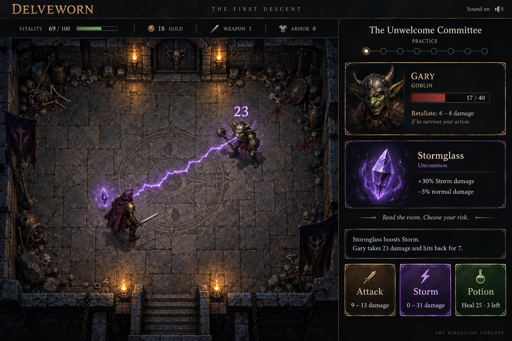

# Milestone B — review guide

This is a visual approval checkpoint, not the Phase 1 blind-test build.

## Open and try

While the local development server is running on this Mac, open
[the room concept](http://127.0.0.1:3100/concept).

1. Inspect the single room, avatar and the purple relic beside its shoulder.
2. Click/tap the floor to walk. Focus the floor and use WASD/arrows to move.
   Movement does not spend health or advance a room.
3. Click **APPROACH GARY**, or walk/tap near Gary. The room stays visible;
   Attack, Storm and Potion become available.
4. Cast **Storm**. The relic and bolt should react; compare the displayed
   enemy damage, retaliation and player HP with the text below the scene.
5. Try **Potion** and **Attack**. Potion text reports net HP after retaliation;
   the normal attack has a narrower range and can crit. While the floor has
   focus, keys 1/2/3 use the same action path as the buttons.
6. Defeat Gary; walk to the open door. The concept ends there and does not
   pretend that nine more playable rooms already exist.
7. Use **Restart the concept** or reload. This explicitly resets the one-room
   training fixture; it does not read/write the normal Practice save.
8. Inspect a narrow window: health/resources, scene, intent/relic summary and
   actions should remain readable; detailed enemy/relic cards appear below.

The fixture starts with 76/100 HP, weapon level 1, 18 gold and Stormglass. It
uses the existing Practice engine with seed `0xdecaf`, reset each time. This is
repeatable preview material, not an earned relic, a verified public result or
an onchain run. Sound uses the existing optional controller/preference.

## Approve the visual target

Recommend this **painted dark-fantasy direction**: readable overhead figures,
layered relic, amber stone lighting, violet Storm, consistent room/HUD language.
The local interaction prototype currently has simpler vector figures. The image
above is an art target created with ImageGen, not a screenshot of that route.

The source for the prompt is `phase-1-evidence/art-direction-prompt.md`. No
complete asset set has been produced. Alternatives are in the specification.

## What is checked, and what is still open

Fresh tests after adding the concept: 81 frontend tests pass, lint has no new
warnings/errors (14 existing warnings), TypeScript passes and the Somnia
standard production build passes. The compiled route metadata has status 404
in production, as intended. It is available only in local development.

Scene illustration exports were rendered directly from SVG source and visually
reviewed. They are **not browser screenshots** and do not verify responsive
layout or inputs. Three in-app Browser attempts were denied because the admin
policy check was unavailable. No alternate interactive browser was used.
Interactive concept QA and real mobile/desktop rendering remain open.

The full pre-change Playwright run found 129 passes, 2 failures and 4 skips.
Both failures reproduced on targeted retry: desktop boss-death audio cleanup
and iPhone SE artwork crowded by the action dock. See `phase-1-status.md`.
The Foundry baseline has 143 passing tests. No onchain transaction was sent.

**Approval request:** approve the painted visual direction and one-room layout,
or identify what should change before full assets and the ten-room dungeon.
The user's explicit milestone B gate is why implementation stops here.

## Resume locally if the server has stopped

From `delveworn/frontend`, run `npm run dev -- --hostname 127.0.0.1 --port 3100`.
The local `/concept` route is deliberately unavailable with `npm run start`.
Static scene exports can be regenerated with
`node --import tsx scripts/render-room-concept.tsx` (uses installed Sharp).

## Before/after material

- `phase-1-evidence/before-desktop.png`, `before-mobile.png`: screenshots from
  actual existing Playwright fixtures before the revised work.
- `phase-1-evidence/concept-scene.png`, `concept-scene-storm.png`: static source
  exports of the simplified interaction scene, not the browser layout.
- `phase-1-evidence/art-direction-target.png`: proposed painted art quality.

These are before/concept comparisons. There is no implemented ten-room "after"
build yet, and this checkpoint is neither production-ready nor blind-test-ready.
